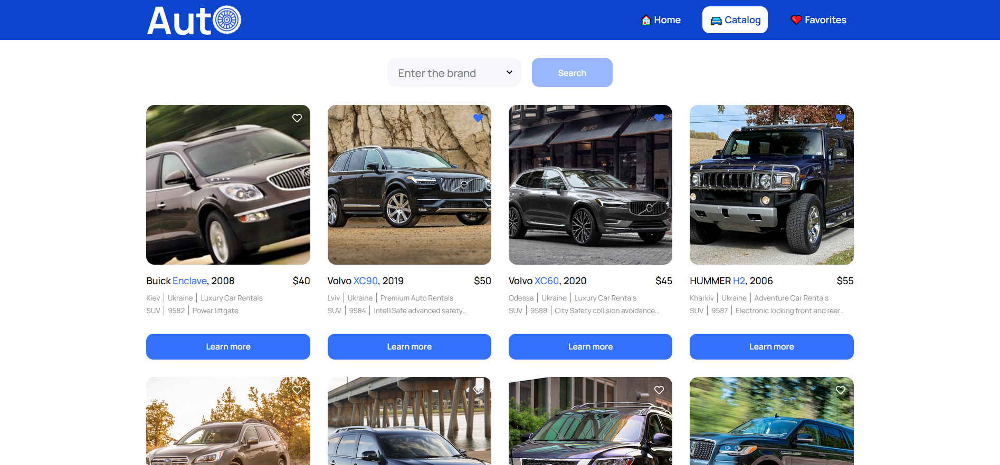
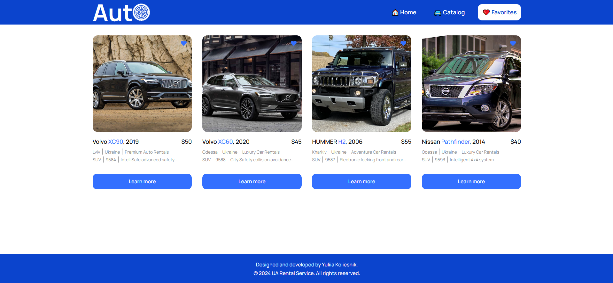

# UA Rental Service Application

Welcome to our Car Rental Service Application! This application allows users to browse and rent cars available for rental. Users can explore various car options, filter them according to their preferences, and add their favorite cars to their list.

## Features

   - *Home Page*: Provides an overview of the services offered by our company.

   

   - *Catalog Page*: Displays a catalog of cars available for rental, where users can filter cars by brand.

   

   - *Favorites Page*: Allows users to view their favorite cars that they have added while browsing the catalog.

   

## Technologies Used

   - *React*: JavaScript library for building user interfaces.
   - *Redux*: State management library for managing application state.
   - *React Router*: Declarative routing for React applications.
   - *Axios*: Promise-based HTTP client for making requests to the server.
   - *MockAPI*: Used for creating a mock backend to store and retrieve car data.
   - *Redux Toolkit*: Official Redux package for improving the development of Redux applications.
   - *React Redux*: Official integration of Redux with React, helping manage the state of applications.
   - *Redux Persist*: Library for persisting Redux state in local storage.
   - *React Icons*: Icon library for use in React applications.
   - *React JSS*: Library for using JSS (JavaScript Style Sheets) in React.
   - *Notiflix*: Library for creating notifications in web applications.
   - *Web Vitals*: Library for measuring key performance indicators of web pages.

## Project Structure

   - *src/components*: Contains all React components used in the application.
   - *src/redux?*: Contains Redux-related files such as actions, reducers, and selectors.
   - *public*: Contains static assets and the index.html file.

## Usage

   - Visit the home page to learn more about our car rental services.
   - Explore the catalog page to view available cars and filter them based on your preferences.
   - Add your favorite cars to your favorites list for easy access.
   - Contact us via the provided phone number for rental inquiries.

   Note: Additionally, the application is adapted for mobile and tablet versions.

## Contributing

Contributions are welcome! If you'd like to contribute to the project, please follow these steps:

    Fork the repository.
    Create a new branch for your feature or fix.
    Make your changes and commit them to your branch.
    Push your changes to your fork.
    Submit a pull request to the main repository.

Thank you for using our UA Rental Service Application! If you have any questions or feedback, feel free to reach out to us. Happy renting! 🚗🔑